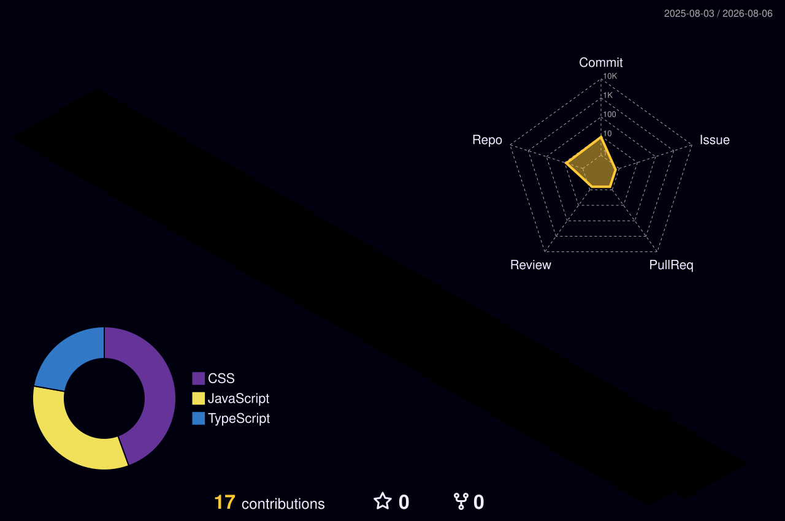

<div align="center">

# Hey there my Cutie Nerd✨
<div align="center">
  <a href="https://Professor126.github.io/pixel-heart" target="_blank">
    
  </a>
</div>


## 📊 My 3D Contribution Graph


## 🐍 Contribution Snake Animation


</div>

<br />

### 🛠️ Tech Stack & Tools

<div align="center">


</div>

<br />

```console
$ professor --status
> Location : Cyber Space
> OS       : Linux / Windows
> Focus    : Building cool tools & visual design
> Status   : Cooking up new ideas...
